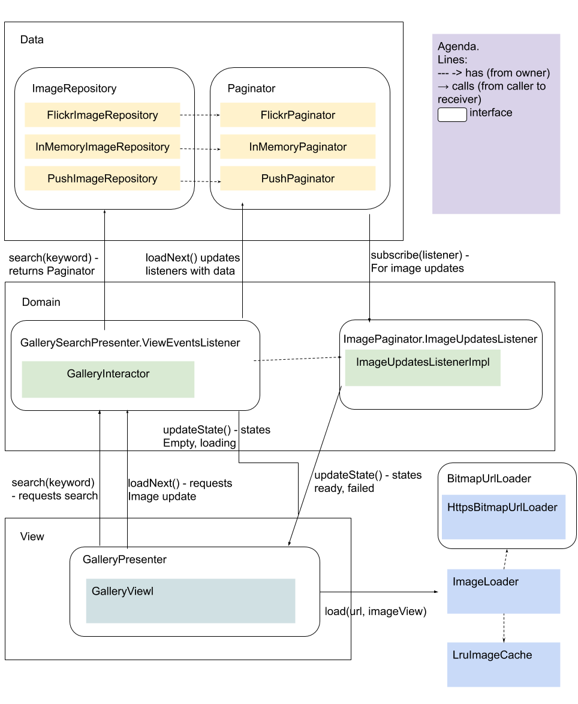

# README #

## What is inside?
- Flickr search gallery with search-as-I-type field. Search keyword must be at least 3 symbols long.
- Unit and integration tests using Mockito and Robolectric.
- Image loading uses `LruCache` to assure better network traffic usage.
- Application saves gallery state on orientation change.
- Shows loading progress while requesting next images and then displays convenient image placeholders while images are processed.
- Purple colored instead of default application icon for easier spotting. Since this is an adaptive icon it will be changed only starting API 26.

## Shortcuts (or what is not in the box)
- Application **is not** caching data for offline usage and displays error message instead.
- Application **does not** save state after it was closed.
- As of now there are **no** UI tests because it is hard to verify that there we correctly loaded pictures.

## Architecture

For an architecture overview please refer to the [following Google Drawing](https://docs.google.com/drawings/d/1r6Xq6DR6mJR96DdIumvpQtsj6Xs_mPr9swNmT4TN9tk/edit?usp=sharing).
Here are some more points about the architecture in general and description and a concrete implementation used in this project.

### Data Level
Abstracts application from specific implementations (such as Flickr API) and allows an easy swap of those implemetations (for example a fake repository used for testing).

### Repository
Repository uses paginator (iterator) to provide images in paginated manner. Paginator is also providing the possibility to register/unregister listeners to provide image updates and error reports (as a replacement for RxJava).

### Interactor Level
Contains business logic and performs transformation of data received from repository into states described in presenter. Presenter states are created as Kotlin ADT(Algebraic Data Types) to organize and restrict all possible states which the presenter can handle. For example, `GallerySearchPresenter` can have the following states: `Empty`, `Loading`, `Ready`, and `Failed`.

### Presenter Level
Consists of stateless passive presenter implemented later on by Android View. It is not storing or managing any state and just showing whatever it gets from the interactor because Android Views are generally hard to test.

### GallerySearchView
Shows search image results using `RecyclerView` with two types of items for ready and loading-in-progress state. `RecyclerView.OnScrollListener` is used to initiate loading of the next pages when the end is reached.

### Activity
Kept as slender as possible since activities are hard to test. Propagate lifecycle events to interactor level, which then used to subscribe/unsubscribe for/from events.

## Tests
Contains Unit Mockito and Robolectric tests. No UI tests were created because of a small project scope and a hard to check testing conditions.

## DI
Consists only of two components. `ApplicationComponent` provides singletons for the entire application (like `LruCache` for images). `GallerySearchComponent` provides specific to search screen dependencies such as `GallerySearchInteractor`. DI component isn't complete and there are still instances created without the DI usage. Consider it a shortcut and a simple DI demonstration.
